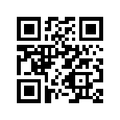

<h1 align="center">vQuill (Vue Quill Editor)</h1>

<p align="center">
  <a href="https://circleci.com/gh/malayvuong/vquill/tree/dev"></a>
  <a href="https://npmcharts.com/compare/@ispa.io/vquill?minimal=true"></a>
  <a href="https://www.npmjs.com/package/@ispa.io/vquill"></a>
  <a href="https://www.npmjs.com/package/@ispa.io/vquill"></a>
  <a href="https://m.me/malayvuong"></a>
</p>

A Vue component used for rich text editor with <a href="https://quilljs.com/">Quill JS</a>. This project created and used for <a href="https://ispa.io">iSPA CMS</a>, so if you used this package, please noted that we maynot check your issue or request.


## Table of contents

- [Getting started](#getting-started)
- [Props](#props)
- [Milestone](#milestone)
- [Versioning](#versioning)
- [License](#license)

## Getting started

### Install
```shell
npm i @ispa.io/vquill     // npm
```

### Usage
```js
import Vue from 'vue';
import vQuill from '@ispa.io/vquill'

Vue.component('vquill', vQuill);

```
### Example
```html
<vquill
  v-model="text"
  :toolbar="toolbar"
  placeholder="Place a text"
></vquill>
```

## Props

  ### Toolbar
  This below is the default of toolbar, you can edit it by yourself for the best tool you need.

```js
toolbar: [
  ['bold', 'italic', 'underline', 'strike'],
  ['blockquote', 'code-block'],
  [{ 'header': 1 }, { 'header': 2 }],
  [{ 'list': 'ordered' }, { 'list': 'bullet' }],
  [{ 'script': 'sub' }, { 'script': 'super' }],
  [{ 'indent': '-1' }, { 'indent': '+1' }],
  [{ 'direction': 'rtl' }],
  [{ 'size': ['small', false, 'large', 'huge'] }],
  [{ 'header': [1, 2, 3, 4, 5, 6, false] }],
  [{ 'color': [] }, { 'background': [] }],
  [{ 'font': [] }],
  [{ 'align': [] }],
  ['clean'],
  ['link', 'image', 'video']
]
```

  ### placeholder
  Placeholder text
  - Type: `String`
  - Default: `Type your text content...`

  ### theme
  This is theme from Quill. Both of themes are included.

  - Type: `String`
  - Default: `snow` | `bubble`

  ### height
  Height of editor container. Only allow `number` type.

  - Type: `Number`
  - Default: `200`

## Milestone


## Versioning

Maintained under the [Semantic Versioning guidelines](https://semver.org/).

## License

[MIT](https://opensource.org/licenses/MIT) © [Malayvuong](https://malayvuong.com/)

### Quill Modules
- [quill-image-extend-module](https://github.com/NextBoy/quill-image-extend-module)
- [quill-image-resize-module](https://github.com/kensnyder/quill-image-resize-module)
- [quill-image-drop-module](https://github.com/kensnyder/quill-image-drop-module)
- [quilljs-table](https://github.com/dost/quilljs-table)
- [more modules...](https://github.com/search?o=desc&q=quill+module&s=stars&type=Repositories&utf8=%E2%9C%93)

### Quill
[Quill API document](https://quilljs.com/docs/quickstart/)

## Invite me a cup of coffee
If you like this project and want to contribute us, then you can send us a cup of coffee by this ways below:

| PAYPAL.ME            | MOMO App (Vietnam) |
|:--------------------:|:------------------:|
|  |  |

[⬆ back to top](#table-of-contents)
